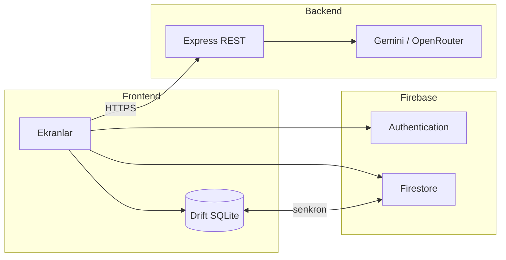

# Kişisel Harcama Koçu

> Yapay zeka destekli, Türkçe kişisel finans uygulaması — gelir/gider takibi, görsel analiz ve gerçek verilere dayalı **Finans Koçu**.

**Geliştirici:** Hatice Gazel  
**Başlangıç:** Nisan 2026 · **Sürüm:** 1.0.0  
**Platform:** Android · iOS · Web

---

## Bu proje ne?

Kişisel Harcama Koçu, günlük gelir ve giderlerini hızlıca kaydetmeni, aylık bakiyeni ve harcama dağılımını görmeni sağlayan **mobil ve web** uygulamasıdır. Aynı hesapla telefondan veya tarayıcıdan giriş yapabilirsin; veriler Firebase üzerinden senkronize edilir. Mobilde veriler önce cihazda tutulur, web'de Drift WebAssembly ile tarayıcıda saklanır.

Uygulamanın ayırt edici tarafı **Finans Koçu**: kullanıcının kendi kayıtlı harcama verilerini okuyarak bütçe, alışkanlık ve hedef konularında kişiselleştirilmiş yanıtlar üretir. Hazır cevaplı bir chatbot değil; her oturumda o ayki gelir, gider ve kategori dağılımı backend'e bağlam olarak gönderilir.

Hedef kitle: Türkiye'deki genç profesyoneller, öğrenciler ve serbest çalışanlar. Arayüz Türkçe, para birimi ₺.

---

## Özellikler

### Giriş ve hesap
- E-posta / şifre ile kayıt ve giriş
- Google ile oturum açma (mobil + web)
- Şifre sıfırlama
- İlk açılışta 3 adımlı tanıtım (atlanabilir), ardından giriş/kayıt ekranı
- **Aynı hesap, tüm platformlar:** Mobilde kaydettiğin işlemler web'de de görünür (Firestore senkronu)

### Dört ana sekme (mobil + web)

| Sekme | İçerik |
|-------|--------|
| **Özet** | Aylık gelir/gider, net bakiye, bütçe kullanım oranı, son işlemler, 7 günlük grafik, AI özet kartı |
| **Analiz** | Pasta grafik, kategori kırılımı, aylık trend, otomatik içgörüler |
| **Takvim** | Ay görünümü, günlük işlem listesi, ısı haritası |
| **Profil** | Tema, kategori yönetimi, manuel senkron, gizlilik metni, çıkış |

### Finans Koçu (AI)
- Sohbet: bütçe soruları, harcama alışkanlığı, hedef belirleme
- Tek tıkla aylık AI analiz özeti
- LLM çağrıları yalnızca backend üzerinden; API anahtarı istemcide tutulmaz

### Web arayüzü (responsive)
- **≥900px genişlik:** Sol sidebar navigasyon, ortalanmış içerik (max 1200px), Finans Koçu ve İşlem ekle butonları sidebar'da
- **<900px genişlik:** Mobil düzen (alt tab bar + FAB) — telefon ve dar tarayıcı penceresi
- Tek Flutter kod tabanı; mobil kod ayrı shell dosyasında korunur (`home_shell_mobile.dart` / `home_shell_web.dart`)

### Veri modeli
- **Offline-first (mobil):** Drift (SQLite) ile yerel kayıt
- **Web:** Drift WebAssembly (`sqlite3.wasm` + `drift_worker.js`) ile tarayıcıda yerel DB
- **Bulut senkronu:** Firebase Firestore — platformlar arası aynı hesap
- Uçak modunda (mobil) işlem eklenebilir; bağlantı gelince senkron devam eder

---

## Mimari

Frontend (Flutter) ve backend (Node.js Express) birbirinden ayrıdır. Backend, LLM isteklerini karşılayan REST API katmanıdır.



**Koç akışı:** Kullanıcı soru sorar → frontend yerel veriden ay özeti oluşturur → backend LLM'e gönderir → yanıt ekranda gösterilir, sohbet geçmişi Firestore'a yazılır.

---

## Teknolojiler

| Katman | Kullanılan |
|--------|------------|
| Frontend | Flutter · Dart · Riverpod · Drift · Firebase · fl_chart |
| Backend | Node.js · Express · Gemini SDK · OpenRouter · firebase-admin |
| AI | Gemini 2.0 Flash, OpenRouter fallback |

Detay: [prodocs/tech-stack.md](prodocs/tech-stack.md)

---

## Repo yapısı

```
├── frontend/     Flutter uygulaması
├── backend/      Node.js REST API
├── prodocs/      PRD, plan, tasarım, geliştirme günlüğü
├── README.md
├── .gitignore
└── .env.example
```

---

## Projeyi çalıştırma

**Backend** (ayrı terminal):
```powershell
cd backend
copy .env.example .env
npm install
npm run dev
```

**Frontend (mobil + web):**
```powershell
cd frontend
flutter pub get
.\run_chrome.ps1    # Web (Chrome) — wasm dosyalarını otomatik indirir
.\run_emulator.ps1 # Android emülatör
```

`run_chrome.ps1` ilk çalıştırmada `web/sqlite3.wasm` ve `web/drift_worker.js` dosyalarını indirir (Drift web veritabanı için gerekli).

Finans Koçu için backend'in `http://localhost:3001` adresinde açık olması gerekir. Android emülatörde `frontend/run_emulator.ps1` script'i `adb reverse` işlemini otomatik yapar.

**Web canlı deploy (Firebase Hosting):**
```powershell
cd frontend
flutter build web --no-tree-shake-icons --dart-define=BACKEND_URL=https://YOUR-BACKEND.onrender.com
firebase deploy --only hosting
```

Firebase ilk kurulum: `frontend/` içinde `flutterfire configure`, ardından `firebase deploy --only firestore:rules`.

---

## API (backend)

| Method | Endpoint | Açıklama |
|--------|----------|----------|
| GET | `/health` | Sağlık kontrolü |
| POST | `/api/v1/coach/chat` | Finans koçu sohbeti |
| POST | `/api/v1/coach/analyze` | Aylık AI özeti |

Sözleşme: [prodocs/api-contract.md](prodocs/api-contract.md)

---

## Dokümantasyon

| Dosya | Konu |
|-------|------|
| [prodocs/PRD.md](prodocs/PRD.md) | Ürün gereksinimleri |
| [prodocs/Plan.md](prodocs/Plan.md) | Teknik adımlar |
| [prodocs/DesignSystem.md](prodocs/DesignSystem.md) | Tasarım sistemi |
| [prodocs/Progress.md](prodocs/Progress.md) | Geliştirme günlüğü |
| [prodocs/architecture.md](prodocs/architecture.md) | Mimari detay |

---

## Güvenlik

API anahtarları ve `.env` dosyaları repoya eklenmez. Şablon: `.env.example` ve `backend/.env.example`. Firestore kuralları kullanıcı bazlı erişimle sınırlandırılmıştır.
