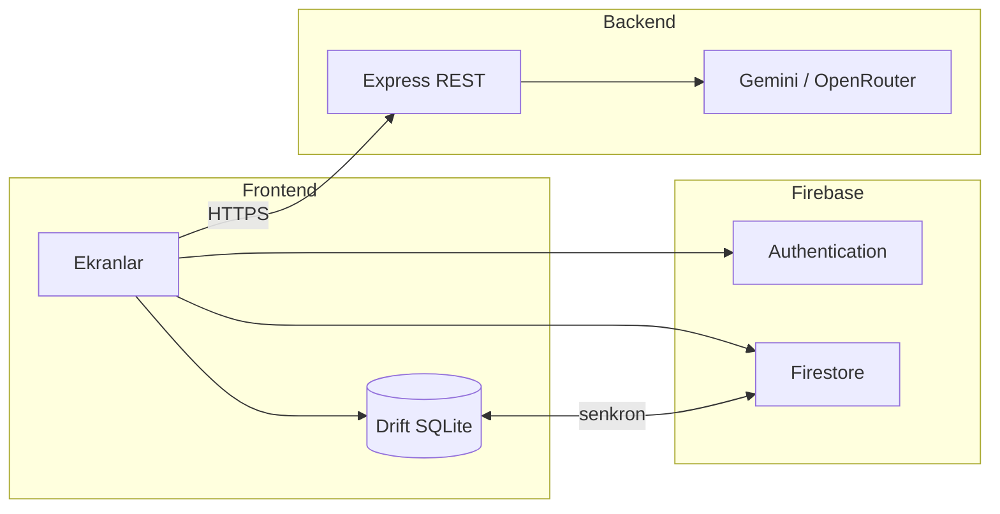

# Kişisel Harcama Koçu

> Yapay zeka destekli, Türkçe kişisel finans uygulaması — gelir/gider takibi, görsel analiz ve gerçek verilere dayalı **Finans Koçu**.

**Geliştirici:** Hatice Gazell  
**Başlangıç:** Nisan 2026 · **Sürüm:** 1.0.0  
**Platform:** Android · iOS · Web

---

## Bu proje ne?

Kişisel Harcama Koçu, günlük gelir ve giderlerini hızlıca kaydetmeni, aylık bakiyeni ve harcama dağılımını görmeni sağlayan bir mobil uygulamadır. Veriler önce cihazda tutulur, ardından Firebase ile senkronize edilir.

Uygulamanın ayırt edici tarafı **Finans Koçu**: kullanıcının kendi kayıtlı harcama verilerini okuyarak bütçe, alışkanlık ve hedef konularında kişiselleştirilmiş yanıtlar üretir. Hazır cevaplı bir chatbot değil; her oturumda o ayki gelir, gider ve kategori dağılımı backend'e bağlam olarak gönderilir.

Hedef kitle: Türkiye'deki genç profesyoneller, öğrenciler ve serbest çalışanlar. Arayüz Türkçe, para birimi ₺.

---

## Özellikler

### Giriş ve hesap
- E-posta / şifre ile kayıt ve giriş
- Google ile oturum açma
- Şifre sıfırlama
- İlk açılışta 3 adımlı tanıtım (atlanabilir), ardından giriş/kayıt ekranı

### Dört ana sekme

| Sekme | İçerik |
|-------|--------|
| **Özet** | Aylık gelir/gider, net bakiye, bütçe kullanım oranı, son işlemler, 7 günlük grafik, AI özet kartı |
| **Analiz** | Pasta grafik, kategori kırılımı, aylık trend, otomatik içgörüler |
| **Takvim** | Ay görünümü, günlük işlem listesi, ısı haritası |
| **Profil** | Tema, kategori yönetimi, manuel senkron, gizlilik metni, çıkış |

### Finans Koçu (AI)
- Sohbet: bütçe soruları, harcama alışkanlığı, hedef belirleme
- Tek tıkla aylık AI analiz özeti
- LLM çağrıları yalnızca backend üzerinden; API anahtarı istemcide tutulmaz

### Veri modeli
- **Offline-first:** Drift (SQLite) ile yerel kayıt
- **Bulut senkronu:** Firebase Firestore
- Uçak modunda işlem eklenebilir; bağlantı gelince senkron devam eder

---

## Mimari

Frontend (Flutter) ve backend (Node.js Express) birbirinden ayrıdır. Backend, LLM isteklerini karşılayan REST API katmanıdır.



**Koç akışı:** Kullanıcı soru sorar → frontend yerel veriden ay özeti oluşturur → backend LLM'e gönderir → yanıt ekranda gösterilir, sohbet geçmişi Firestore'a yazılır.

---

## Teknolojiler

| Katman | Kullanılan |
|--------|------------|
| Frontend | Flutter · Dart · Riverpod · Drift · Firebase · fl_chart |
| Backend | Node.js · Express · Gemini SDK · OpenRouter · firebase-admin |
| AI | Gemini 2.0 Flash, OpenRouter fallback |

Detay: [prodocs/tech-stack.md](prodocs/tech-stack.md)

---

## Repo yapısı

```
├── frontend/     Flutter uygulaması
├── backend/      Node.js REST API
├── prodocs/      PRD, plan, tasarım, geliştirme günlüğü
├── README.md
├── .gitignore
└── .env.example
```

---

## Projeyi çalıştırma

**Backend** (ayrı terminal):
```powershell
cd backend
copy .env.example .env
npm install
npm run dev
```

**Frontend:**
```powershell
cd frontend
flutter pub get
.\run_chrome.ps1
```

Finans Koçu için backend'in `http://localhost:3001` adresinde açık olması gerekir. Android emülatörde `frontend/run_emulator.ps1` script'i `adb reverse` işlemini otomatik yapar.

Firebase ilk kurulum: `frontend/` içinde `flutterfire configure`, ardından `firebase deploy --only firestore:rules`.

---

## API (backend)

| Method | Endpoint | Açıklama |
|--------|----------|----------|
| GET | `/health` | Sağlık kontrolü |
| POST | `/api/v1/coach/chat` | Finans koçu sohbeti |
| POST | `/api/v1/coach/analyze` | Aylık AI özeti |

Sözleşme: [prodocs/api-contract.md](prodocs/api-contract.md)

---

## Dokümantasyon

| Dosya | Konu |
|-------|------|
| [prodocs/PRD.md](prodocs/PRD.md) | Ürün gereksinimleri |
| [prodocs/Plan.md](prodocs/Plan.md) | Teknik adımlar |
| [prodocs/DesignSystem.md](prodocs/DesignSystem.md) | Tasarım sistemi |
| [prodocs/Progress.md](prodocs/Progress.md) | Geliştirme günlüğü |
| [prodocs/architecture.md](prodocs/architecture.md) | Mimari detay |

---

## Güvenlik

API anahtarları ve `.env` dosyaları repoya eklenmez. Şablon: `.env.example` ve `backend/.env.example`. Firestore kuralları kullanıcı bazlı erişimle sınırlandırılmıştır.
