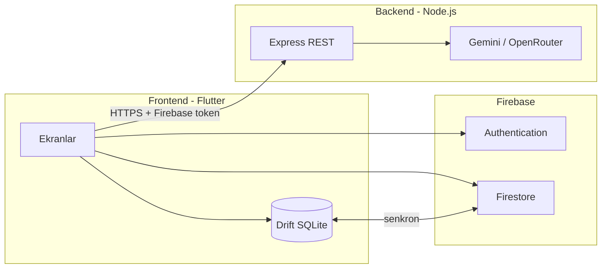

# Kişisel Harcama Koçu

> Yapay zeka destekli, Türkçe kişisel finans uygulaması — gelir/gider takibi, görsel analiz ve gerçek verilerine dayalı **Finans Koçu**.

**Geliştirici:** Hatice Gazell  
**Başlangıç:** Nisan 2026 · **Sürüm:** 1.0.0 (MVP)  
**Platform:** Android · iOS · Web

---

## İçindekiler

- [Problem ve çözüm](#problem-ve-çözüm)
- [Öne çıkan özellikler](#öne-çıkan-özellikler)
- [Mimari](#mimari)
- [Teknoloji özeti](#teknoloji-özeti)
- [Repo yapısı](#repo-yapısı)
- [Gereksinimler](#gereksinimler)
- [Yerel kurulum](#yerel-kurulum)
- [Canlıya alma](#canlıya-alma)
- [API](#api)
- [Dokümantasyon](#dokümantasyon)
- [Güvenlik](#güvenlik)

---

## Problem ve çözüm

**Problem:** Birçok kişi harcamalarını dağınık notlarda veya hiç takip etmeden yönetiyor. Ay sonunda nereye harcadığını bilmemek bütçe planlamasını zorlaştırıyor.

**Çözüm:** Kişisel Harcama Koçu, gelir ve giderleri saniyeler içinde kaydetmeni sağlar; aylık bakiye, kategori analizi ve takvim görünümü sunar. **Finans Koçu** ise senin gerçek harcama verilerini okuyarak kişiselleştirilmiş tavsiyeler verir — generic bir sohbet botu değil.

**Hedef kitle:** Türkiye'deki genç profesyoneller, öğrenciler ve serbest çalışanlar (Türkçe arayüz, ₺ para birimi).

---

## Öne çıkan özellikler

### Kimlik ve güvenlik
- E-posta / şifre ile kayıt ve giriş
- Google ile tek tıkla oturum açma
- Şifre sıfırlama, Firebase Authentication
- Firestore kuralları: kullanıcı yalnızca kendi verisine erişir

### Dört ana ekran

| Sekme | Ne sunar? |
|-------|-----------|
| **Özet** | Aylık gelir/gider, net bakiye, bütçe kullanım oranı, son işlemler, 7 günlük grafik, AI özet kartı |
| **Analiz** | Pasta grafik, kategori kırılımı, aylık trend, otomatik içgörüler |
| **Takvim** | Ay görünümü, günlük işlem listesi, ısı haritası |
| **Profil** | Tema, kategori yönetimi, manuel senkron, gizlilik metni, çıkış |

### Yapay zeka — Finans Koçu
- Kullanıcının **gerçek** gelir, gider ve kategori verisi backend'e bağlam olarak gider
- Sohbet: bütçe soruları, harcama alışkanlığı, hedef belirleme
- Tek tıkla aylık AI analiz özeti
- LLM çağrıları **yalnızca backend** üzerinden; API anahtarı istemcide tutulmaz

### Offline-first veri
- İşlemler önce cihazda (Drift / SQLite) kaydedilir
- İnternet gelince Firebase Firestore ile senkronize edilir
- Uçak modunda kayıt yapılabilir; veri cihazda kalır

### İlk açılış deneyimi
- 3 adımlı tanıtım ekranı (atlanabilir)
- Ardından sade giriş / kayıt formu

---

## Mimari

Frontend ve backend **ayrı katmanlar** olarak tasarlandı. Backend, ileride farklı istemcilere (mobil, web, üçüncü parti) hizmet verebilecek REST API yapısında yazıldı.



**AI koç akışı (kısaca):**
1. Kullanıcı soru yazar veya "Analiz Et"e basar.
2. Frontend yerel veritabanından ay özeti oluşturur.
3. `POST /api/v1/coach/chat` veya `/analyze` çağrılır.
4. Backend Gemini (veya OpenRouter) ile yanıt üretir.
5. Yanıt ekranda gösterilir; sohbet geçmişi Firestore'a kaydedilir.

Detaylı mimari: [prodocs/architecture.md](prodocs/architecture.md)

---

## Teknoloji özeti

| Katman | Teknolojiler |
|--------|--------------|
| **Frontend** | Flutter 3 · Dart · Riverpod · Drift · Firebase Auth/Firestore · fl_chart |
| **Backend** | Node.js 20 · Express · Gemini SDK · OpenRouter · firebase-admin |
| **AI** | Google Gemini 2.0 Flash (birincil), OpenRouter fallback |
| **Deploy** | Firebase Hosting (web) · Render (API) |

Tam liste ve gerekçeler: [prodocs/tech-stack.md](prodocs/tech-stack.md)

---

## Repo yapısı

```
├── frontend/          Flutter uygulaması (lib/, android/, ios/, web/)
│   ├── firebase.json  Firebase Hosting + Firestore deploy
│   └── run_*.ps1      Yerel çalıştırma scriptleri (Chrome / emülatör)
├── backend/           Node.js REST API (LLM proxy)
├── prodocs/           PRD, plan, tasarım sistemi, geliştirme günlüğü
├── README.md          Bu dosya
├── .gitignore
└── .env.example       Ortam değişkeni şablonu (gerçek key yok)
```

---

## Canlı demo

| Bileşen | URL |
|---------|-----|
| Web uygulaması | *(deploy sonrası buraya ekle)* |
| Backend `/health` | *(deploy sonrası buraya ekle)* |

---

## Gereksinimler

**Frontend**
- Flutter SDK 3.5+
- Android Studio veya VS Code
- Firebase projesi (Auth + Firestore)

**Backend**
- Node.js 18+
- Gemini API key veya OpenRouter key

**Opsiyonel**
- Android emülatör veya fiziksel cihaz
- Firebase CLI (`firebase deploy` için)

---

## Yerel kurulum

### 1. Repoyu klonla

```powershell
git clone https://github.com/gazellhatice/UpSchool-301-2026.git
cd UpSchool-301-2026
```

### 2. Backend'i başlat

```powershell
cd backend
copy .env.example .env
```

`.env` dosyasını düzenle:
- `OPENROUTER_API_KEY` veya `GEMINI_API_KEY`
- `AI_PROVIDER=openrouter` veya `gemini`
- `CORS_ORIGINS` (Chrome için `http://localhost:8080` ekle)

```powershell
npm install
npm run dev
```

Backend `http://localhost:3001` adresinde çalışır. Test: `http://localhost:3001/health`

### 3. Frontend'i yapılandır

```powershell
cd frontend
flutter pub get
dart run build_runner build --delete-conflicting-outputs
```

Firebase henüz kurulmadıysa:
```powershell
dart pub global activate flutterfire_cli
flutterfire configure
```

### 4. Uygulamayı çalıştır

**Chrome (en kolay yol):**
```powershell
cd frontend
.\run_chrome.ps1
```

**Android emülatör:**
```powershell
cd frontend
.\run_emulator.ps1 -ColdBoot
```

> **Finans Koçu için backend açık olmalı.** Emülatörde port yönlendirme `run_emulator.ps1` ile otomatik yapılır (`adb reverse tcp:3001 tcp:3001`). Elle çalıştırıyorsan backend + reverse komutunu unutma.

### 5. Firestore kuralları (ilk kurulum)

```powershell
cd frontend
firebase deploy --only firestore:rules
```

---

## Canlıya alma

### Backend → Render

1. [render.com](https://render.com) → New Web Service
2. **Root Directory:** `backend`
3. **Build command:** `npm install`
4. **Start command:** `npm start`
5. **Environment variables:**
   - `GEMINI_API_KEY` veya `OPENROUTER_API_KEY`
   - `AI_PROVIDER`
   - `FIREBASE_PROJECT_ID`
   - `FIREBASE_SERVICE_ACCOUNT` (JSON, tek satır)
   - `CORS_ORIGINS` → web uygulamanın URL'si
   - `NODE_ENV=production`

Deploy sonrası `https://YOUR-SERVICE.onrender.com/health` adresini doğrula.

### Frontend Web → Firebase Hosting

```powershell
cd frontend
flutter build web --dart-define=BACKEND_URL=https://YOUR-SERVICE.onrender.com
firebase deploy --only hosting
```

### Android APK (opsiyonel)

```powershell
cd frontend
flutter build apk --dart-define=BACKEND_URL=https://YOUR-SERVICE.onrender.com
```

---

## API

| Method | Endpoint | Açıklama |
|--------|----------|----------|
| `GET` | `/health` | Sağlık kontrolü |
| `POST` | `/api/v1/coach/chat` | Finans koçu sohbeti (mesaj geçmişi + finans bağlamı) |
| `POST` | `/api/v1/coach/analyze` | Aylık AI finans özeti |

Kimlik doğrulama: `Authorization: Bearer <Firebase ID Token>`  
Detaylı sözleşme: [prodocs/api-contract.md](prodocs/api-contract.md)

---

## Dokümantasyon

| Dosya | İçerik |
|-------|--------|
| [prodocs/PRD.md](prodocs/PRD.md) | Problem, hedef kitle, gereksinimler |
| [prodocs/Plan.md](prodocs/Plan.md) | Teknik uygulama adımları |
| [prodocs/tech-stack.md](prodocs/tech-stack.md) | Teknoloji seçimleri, AI kullanımı |
| [prodocs/DesignSystem.md](prodocs/DesignSystem.md) | Renk, tipografi, bileşen kuralları |
| [prodocs/Progress.md](prodocs/Progress.md) | Geliştirme günlüğü (Nisan 2026'dan itibaren) |
| [prodocs/mvp-scope.md](prodocs/mvp-scope.md) | MVP kapsamı ve kabul kriterleri |

---

## Güvenlik

- Gerçek API anahtarları, Firebase service account JSON ve `.env` dosyaları **repoya commit edilmemelidir**.
- Şablonlar: kök `.env.example` ve `backend/.env.example`
- LLM anahtarları yalnızca backend ortam değişkenlerinde tutulur.
- Firestore kuralları kullanıcı bazlı erişimle sınırlandırılmıştır (`frontend/firestore.rules`).

---

## Lisans

Özel kullanım — `publish_to: 'none'`
